# Ex-07-Feature-Selection
## AIM
To Perform the various feature selection techniques on a dataset and save the data to a file. 

# Explanation
Feature selection is to find the best set of features that allows one to build useful models.
Selecting the best features helps the model to perform well. 

# ALGORITHM
### STEP 1
Read the given Data
### STEP 2
Clean the Data Set using Data Cleaning Process
### STEP 3
Apply Feature selection techniques to all the features of the data set
### STEP 4
Save the data to the file


# PROGRAM:
```
Developed By: Silambarasan K
Reg No:212221230101
```
```py
#importing library
import pandas as pd
import numpy as np
import seaborn as sns
import pandas as pd
import matplotlib.pyplot as plt

# data loading
data = pd.read_csv('titanic_dataset.csv')
data
data.tail()
data.isnull().sum()
data.describe()

#now, we are checking start with a pairplot, and check for missing values
sns.heatmap(data.isnull(),cbar=False)

#Data Cleaning and Data Drop Process
data['Fare'] = data['Fare'].fillna(data['Fare'].dropna().median())
data['Age'] = data['Age'].fillna(data['Age'].dropna().median())

# Change to categoric column to numeric
data.loc[data['Sex']=='male','Sex']=0
data.loc[data['Sex']=='female','Sex']=1

# instead of nan values
data['Embarked']=data['Embarked'].fillna('S') 

# Change to categoric column to numeric
data.loc[data['Embarked']=='S','Embarked']=0
data.loc[data['Embarked']=='C','Embarked']=1
data.loc[data['Embarked']=='Q','Embarked']=2

#Drop unnecessary columns
drop_elements = ['Name','Cabin','Ticket']
data = data.drop(drop_elements, axis=1)

data.head(11)

#heatmap for train dataset
f,ax = plt.subplots(figsize=(5, 5))
sns.heatmap(data.corr(), annot=True, linewidths=.5, fmt= '.1f',ax=ax)

# Now, data is clean and read to a analyze
sns.heatmap(data.isnull(),cbar=False)

# how many people survived or not... %60 percent died %40 percent survived
fig = plt.figure(figsize=(18,6))
data.Survived.value_counts(normalize=True).plot(kind='bar',alpha=0.5)
plt.show()

#Age with survived
plt.scatter(data.Survived, data.Age, alpha=0.1)
plt.title("Age with Survived")
plt.show()

#Count the pessenger class
fig = plt.figure(figsize=(18,6))
data.Pclass.value_counts(normalize=True).plot(kind='bar',alpha=0.5)
plt.show()

from sklearn.feature_selection import SelectKBest
from sklearn.feature_selection import chi2

X = data.drop("Survived",axis=1)
y = data["Survived"]

mdlsel = SelectKBest(chi2, k=5) 
mdlsel.fit(X,y)
ix = mdlsel.get_support() 
data2 = pd.DataFrame(mdlsel.transform(X), columns = X.columns.values[ix]) # en iyi leri aldi... 7 tane...
data2.head(11)

from sklearn.ensemble import RandomForestClassifier
from sklearn.metrics import accuracy_score
from sklearn.model_selection import train_test_split

target = data['Survived'].values
data_features_names = ['Pclass','Sex','SibSp','Parch','Fare','Embarked','Age']
features = data[data_features_names].values

#Build test and training test
X_train,X_test,y_train,y_test = train_test_split(features,target,test_size=0.3,random_state=42)

my_forest = RandomForestClassifier(max_depth=5, min_samples_split=10, n_estimators=500, random_state=5,criterion = 'entropy')


my_forest_ = my_forest.fit(X_train,y_train)
target_predict=my_forest_.predict(X_test)

print("Random forest score: ",accuracy_score(y_test,target_predict))

from sklearn.metrics import mean_squared_error, r2_score
print ("MSE    :",mean_squared_error(y_test,target_predict))
print ("R2     :",r2_score(y_test,target_predict))
```
# OUPUT:
### Dataset:
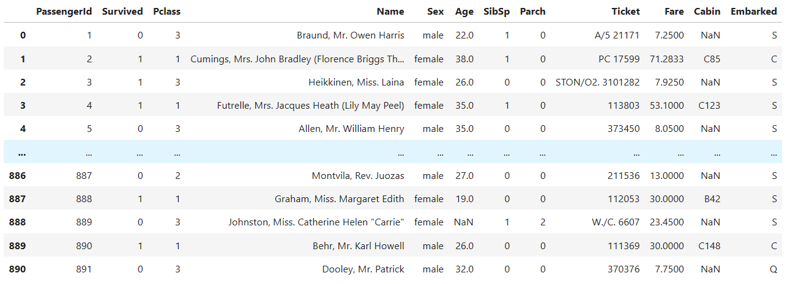

### Null Values:
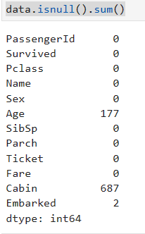

### Describe:
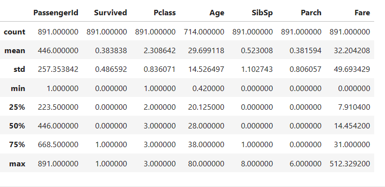

### missing values::
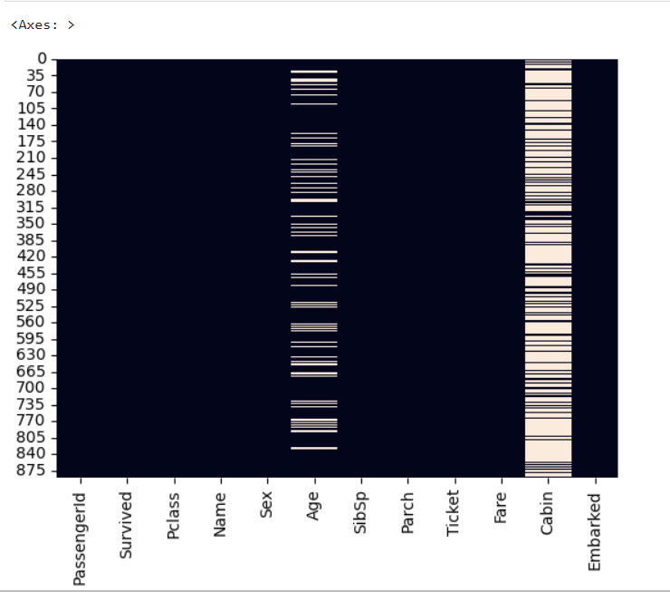

### Data after cleaning:
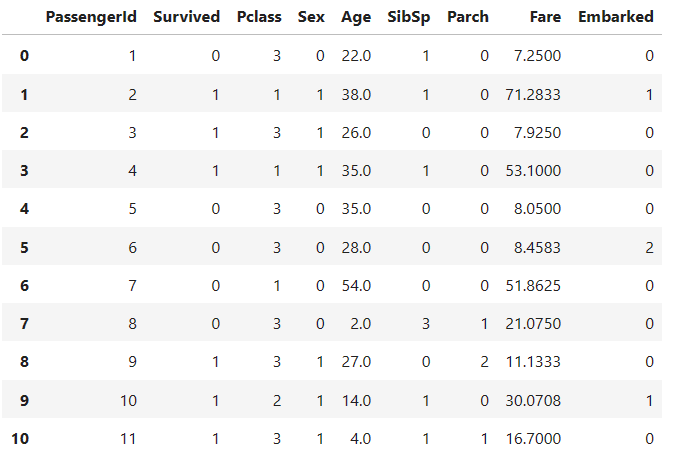

### Data on Heatmap:
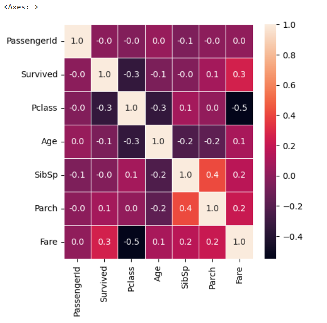 

### Cleaned Null values:
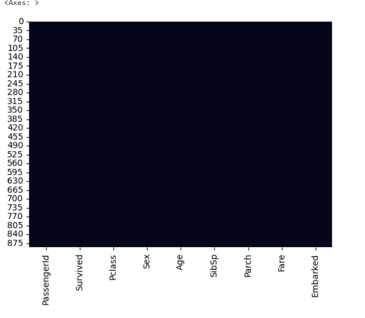

### Report of (people survived & Died):
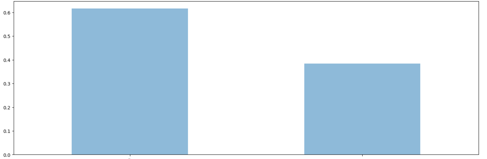

### Report of Survived People's Age:
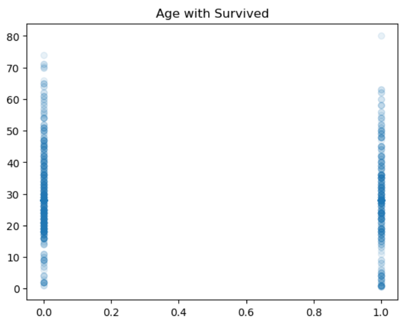

### Report of pessengers:
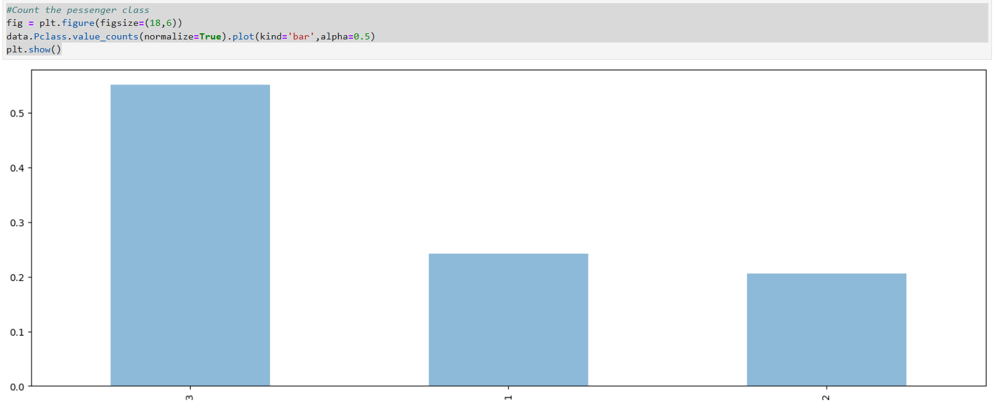

### Report:
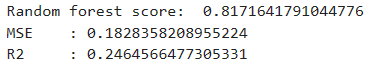

## RESULT:
Thus, Sucessfully performed the various feature selection techniques on a given dataset.
